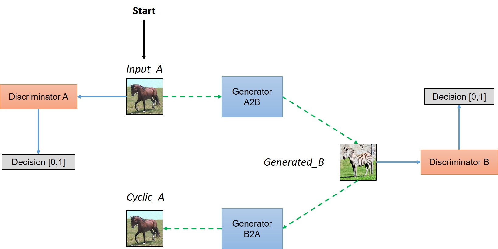
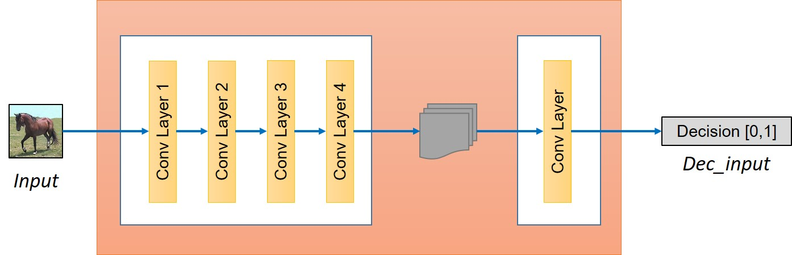
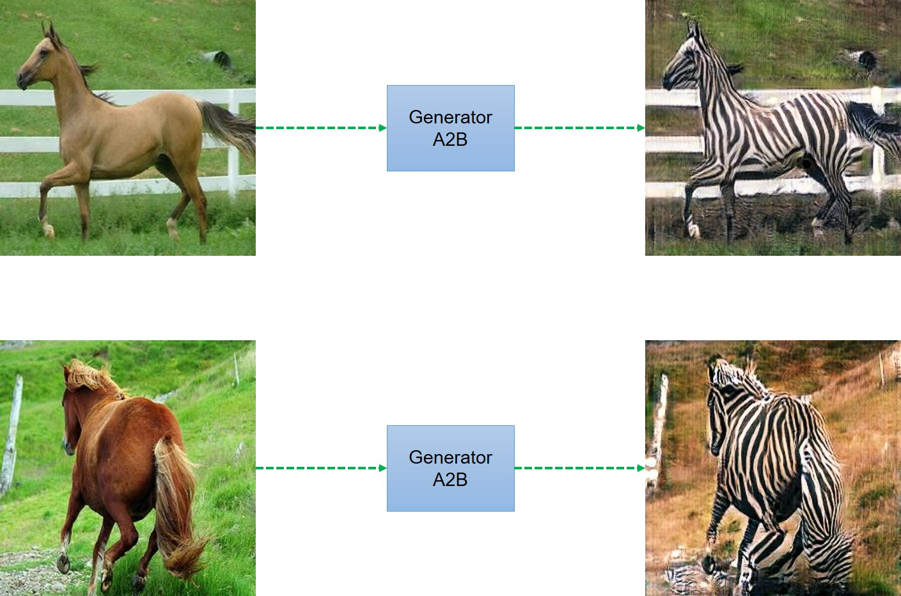
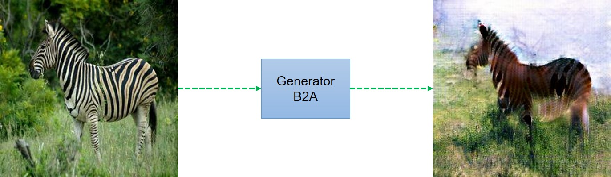

# CycleGAN
Tensorflow implementation of CycleGAN.

1. [Original implementation](https://github.com/junyanz/CycleGAN/)
2. [Paper](https://arxiv.org/abs/1703.10593)

### CycleGAN model

CycleGAN model can be summarized in the following image. For full details about implementation and understanding CycleGAN you can read the tutorial at this [link](https://hardikbansal.github.io/CycleGANBlog/)

##### Generator

##### Discriminator

### Our Results

We ran the model for [horse2zebra dataset](https://people.eecs.berkeley.edu/~taesung_park/CycleGAN/datasets/horse2zebra.zip) but because of the lack of resources, we just ran the model for 100 epochs and got following results.

### Final Comments

1. During training we noticed that the ouput results were sensitive to initialization. Thanks to [vanhuyz](https://github.com/vanhuyz) for pointing this out and suggesting training multiple times to get best results. You might notice background color being reversed as in following image. This effect can be observed only after 10-20 epochs and you can try to run the code again.

2. We also think that this model is not good fit to change the shape of object. We tried to run the model for converting a men's face to a look alike women's face. For that we used celebA dataset but the results are not good and images produced are quite distorted.

### Blog

If you would like to understand the paper and see  how to implement it by your own, you can have look at the blog by [me](https://hardikbansal.github.io/CycleGANBlog/)
